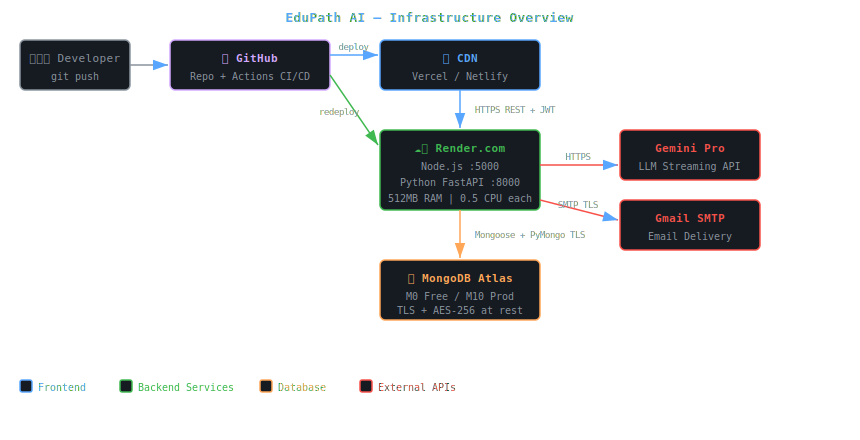
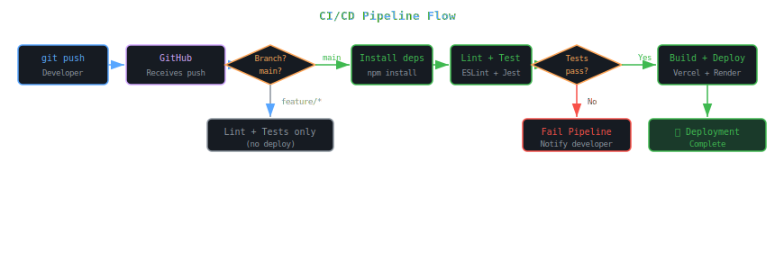

<body style="font-family:-apple-system,BlinkMacSystemFont,'Segoe UI',sans-serif;background:#0d1117;color:#c9d1d9;margin:0;padding:24px;line-height:1.7;max-width:1200px;margin:0 auto;">

<h1 style="font-size:2.4em;color:#58a6ff;border-bottom:3px solid #21262d;padding-bottom:16px;">⚙️ DevOps Architecture</h1>

EduPath AI | Version 1.0 | March 2026

<h2 style="color:#79c0ff;">1. Infrastructure Overview</h2>

EduPath AI uses a <b>cloud-native, serverless-friendly deployment model</b> with three independently hosted services. Each service is deployed on a platform optimized for its runtime, with zero infrastructure management overhead.

<table style="border-collapse:collapse;width:100%;">
<tr style="background:#161b22;"><th style="border:1px solid #30363d;padding:10px;color:#79c0ff;">Service</th><th style="border:1px solid #30363d;padding:10px;color:#79c0ff;">Platform</th><th style="border:1px solid #30363d;padding:10px;color:#79c0ff;">Runtime</th><th style="border:1px solid #30363d;padding:10px;color:#79c0ff;">URL Pattern</th><th style="border:1px solid #30363d;padding:10px;color:#79c0ff;">Auto-Deploy</th></tr>
<tr><td style="border:1px solid #30363d;padding:10px;">Frontend (React SPA)</td><td style="border:1px solid #30363d;padding:10px;">Vercel / Netlify</td><td style="border:1px solid #30363d;padding:10px;">Static CDN</td><td style="border:1px solid #30363d;padding:10px;">edupath.vercel.app</td><td style="border:1px solid #30363d;padding:10px;">✅ On push to main</td></tr>
<tr><td style="border:1px solid #30363d;padding:10px;">Backend (Node.js)</td><td style="border:1px solid #30363d;padding:10px;">Render.com</td><td style="border:1px solid #30363d;padding:10px;">Node.js 18</td><td style="border:1px solid #30363d;padding:10px;">edupath-api.onrender.com</td><td style="border:1px solid #30363d;padding:10px;">✅ On push to main</td></tr>
<tr><td style="border:1px solid #30363d;padding:10px;">AI Service (Python)</td><td style="border:1px solid #30363d;padding:10px;">Render.com</td><td style="border:1px solid #30363d;padding:10px;">Python 3.10</td><td style="border:1px solid #30363d;padding:10px;">edupath-ai.onrender.com</td><td style="border:1px solid #30363d;padding:10px;">✅ On push to main</td></tr>
<tr><td style="border:1px solid #30363d;padding:10px;">Database</td><td style="border:1px solid #30363d;padding:10px;">MongoDB Atlas</td><td style="border:1px solid #30363d;padding:10px;">MongoDB 7.0</td><td style="border:1px solid #30363d;padding:10px;">cluster0.xxxxx.mongodb.net</td><td style="border:1px solid #30363d;padding:10px;">Managed service</td></tr>
</table>

<h2 style="color:#79c0ff;">2. Infrastructure Diagram</h2>

<h2 style="color:#79c0ff;">3. Hosting Platform Details</h2>

<h3 style="color:#d2a8ff;">Frontend — Vercel / Netlify</h3>
<table style="border-collapse:collapse;width:100%;">
<tr style="background:#161b22;"><th style="border:1px solid #30363d;padding:10px;color:#79c0ff;">Feature</th><th style="border:1px solid #30363d;padding:10px;color:#79c0ff;">Detail</th></tr>
<tr><td style="border:1px solid #30363d;padding:10px;">Build command</td><td style="border:1px solid #30363d;padding:10px;"><code style="color:#f0883e;">npm run build</code> (Vite)</td></tr>
<tr><td style="border:1px solid #30363d;padding:10px;">Output directory</td><td style="border:1px solid #30363d;padding:10px;"><code style="color:#f0883e;">dist/</code></td></tr>
<tr><td style="border:1px solid #30363d;padding:10px;">Node version</td><td style="border:1px solid #30363d;padding:10px;">18.x</td></tr>
<tr><td style="border:1px solid #30363d;padding:10px;">SPA routing</td><td style="border:1px solid #30363d;padding:10px;">Redirect all routes to index.html (configured in vercel.json / _redirects)</td></tr>
<tr><td style="border:1px solid #30363d;padding:10px;">CDN</td><td style="border:1px solid #30363d;padding:10px;">Global edge network — sub-100ms TTFB worldwide</td></tr>
<tr><td style="border:1px solid #30363d;padding:10px;">Preview deployments</td><td style="border:1px solid #30363d;padding:10px;">Auto-generated URL for every PR</td></tr>
</table>

<h3 style="color:#d2a8ff;">Backend — Render.com Web Service</h3>
<table style="border-collapse:collapse;width:100%;">
<tr style="background:#161b22;"><th style="border:1px solid #30363d;padding:10px;color:#79c0ff;">Feature</th><th style="border:1px solid #30363d;padding:10px;color:#79c0ff;">Detail</th></tr>
<tr><td style="border:1px solid #30363d;padding:10px;">Start command</td><td style="border:1px solid #30363d;padding:10px;"><code style="color:#f0883e;">node server.js</code></td></tr>
<tr><td style="border:1px solid #30363d;padding:10px;">Build command</td><td style="border:1px solid #30363d;padding:10px;"><code style="color:#f0883e;">npm install</code></td></tr>
<tr><td style="border:1px solid #30363d;padding:10px;">Health check path</td><td style="border:1px solid #30363d;padding:10px;"><code style="color:#f0883e;">GET /health</code></td></tr>
<tr><td style="border:1px solid #30363d;padding:10px;">Auto-deploy</td><td style="border:1px solid #30363d;padding:10px;">On push to main branch</td></tr>
<tr><td style="border:1px solid #30363d;padding:10px;">Free tier limitation</td><td style="border:1px solid #30363d;padding:10px;">Spins down after 15 min inactivity — cold start ~30s</td></tr>
<tr><td style="border:1px solid #30363d;padding:10px;">Env vars</td><td style="border:1px solid #30363d;padding:10px;">Set in Render dashboard — injected at runtime</td></tr>
</table>

<h3 style="color:#d2a8ff;">AI Service — Render.com Web Service (Python)</h3>
<table style="border-collapse:collapse;width:100%;">
<tr style="background:#161b22;"><th style="border:1px solid #30363d;padding:10px;color:#79c0ff;">Feature</th><th style="border:1px solid #30363d;padding:10px;color:#79c0ff;">Detail</th></tr>
<tr><td style="border:1px solid #30363d;padding:10px;">Start command</td><td style="border:1px solid #30363d;padding:10px;"><code style="color:#f0883e;">uvicorn main:app --host 0.0.0.0 --port 8000</code></td></tr>
<tr><td style="border:1px solid #30363d;padding:10px;">Build command</td><td style="border:1px solid #30363d;padding:10px;"><code style="color:#f0883e;">pip install -r requirements.txt</code></td></tr>
<tr><td style="border:1px solid #30363d;padding:10px;">Health check path</td><td style="border:1px solid #30363d;padding:10px;"><code style="color:#f0883e;">GET /health</code></td></tr>
<tr><td style="border:1px solid #30363d;padding:10px;">Startup behavior</td><td style="border:1px solid #30363d;padding:10px;">Builds NetworkX knowledge graph on startup — ~5s cold start</td></tr>
<tr><td style="border:1px solid #30363d;padding:10px;">Python version</td><td style="border:1px solid #30363d;padding:10px;">3.10.x</td></tr>
</table>

<h3 style="color:#d2a8ff;">Database — MongoDB Atlas</h3>
<table style="border-collapse:collapse;width:100%;">
<tr style="background:#161b22;"><th style="border:1px solid #30363d;padding:10px;color:#79c0ff;">Feature</th><th style="border:1px solid #30363d;padding:10px;color:#79c0ff;">Detail</th></tr>
<tr><td style="border:1px solid #30363d;padding:10px;">Tier</td><td style="border:1px solid #30363d;padding:10px;">M0 (free) for dev, M10 ($57/mo) for production</td></tr>
<tr><td style="border:1px solid #30363d;padding:10px;">Backups</td><td style="border:1px solid #30363d;padding:10px;">Continuous backup on M10+, daily snapshots on M0</td></tr>
<tr><td style="border:1px solid #30363d;padding:10px;">Encryption</td><td style="border:1px solid #30363d;padding:10px;">AES-256 at rest, TLS 1.2+ in transit</td></tr>
<tr><td style="border:1px solid #30363d;padding:10px;">Network access</td><td style="border:1px solid #30363d;padding:10px;">IP whitelist: Render.com IP ranges only</td></tr>
<tr><td style="border:1px solid #30363d;padding:10px;">Connection pooling</td><td style="border:1px solid #30363d;padding:10px;">Mongoose default pool (5 connections)</td></tr>
</table>

<h2 style="color:#79c0ff;">4. Pipeline Overview</h2>

<h2 style="color:#79c0ff;">5. Rollback Strategy</h2>
<table style="border-collapse:collapse;width:100%;">
<tr style="background:#161b22;"><th style="border:1px solid #30363d;padding:10px;color:#79c0ff;">Service</th><th style="border:1px solid #30363d;padding:10px;color:#79c0ff;">Rollback Method</th><th style="border:1px solid #30363d;padding:10px;color:#79c0ff;">Time to Rollback</th></tr>
<tr><td style="border:1px solid #30363d;padding:10px;">Frontend</td><td style="border:1px solid #30363d;padding:10px;">Vercel/Netlify dashboard → click "Redeploy" on previous deployment</td><td style="border:1px solid #30363d;padding:10px;">&lt; 1 minute</td></tr>
<tr><td style="border:1px solid #30363d;padding:10px;">Backend</td><td style="border:1px solid #30363d;padding:10px;">Render.com dashboard → Manual deploy → select previous commit</td><td style="border:1px solid #30363d;padding:10px;">2–5 minutes</td></tr>
<tr><td style="border:1px solid #30363d;padding:10px;">AI Service</td><td style="border:1px solid #30363d;padding:10px;">Render.com dashboard → Manual deploy → select previous commit</td><td style="border:1px solid #30363d;padding:10px;">3–7 minutes</td></tr>
<tr><td style="border:1px solid #30363d;padding:10px;">Database</td><td style="border:1px solid #30363d;padding:10px;">MongoDB Atlas point-in-time restore (M10+) or snapshot restore</td><td style="border:1px solid #30363d;padding:10px;">5–30 minutes</td></tr>
</table>

</body>
