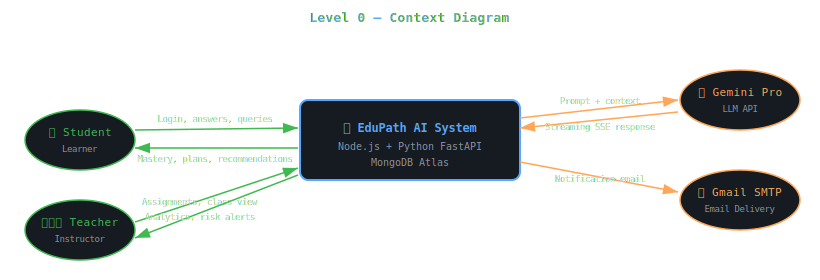
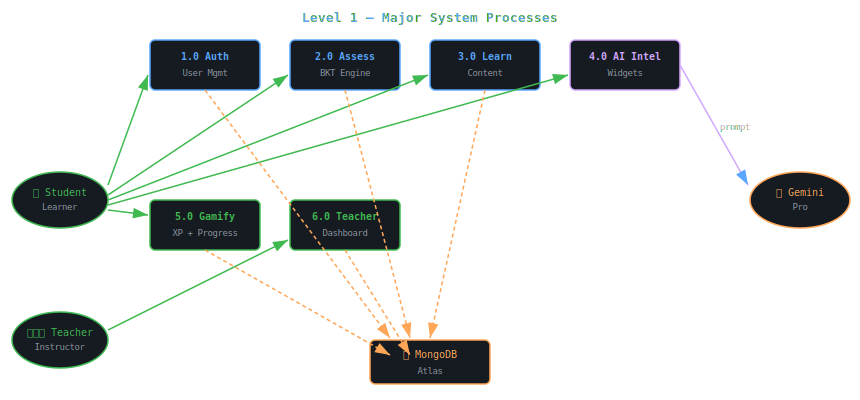
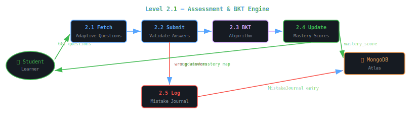
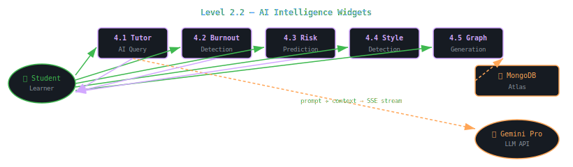
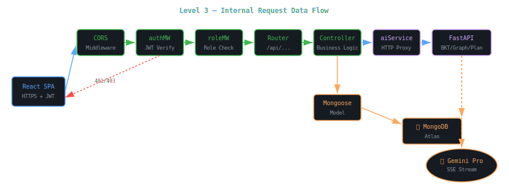

<body style="font-family:-apple-system,BlinkMacSystemFont,'Segoe UI',sans-serif;background:#0d1117;color:#c9d1d9;margin:0;padding:24px;line-height:1.7;max-width:1200px;margin:0 auto;">

<h1 style="font-size:2.4em;color:#58a6ff;border-bottom:3px solid #21262d;padding-bottom:16px;">🔄 Data Flow Diagram</h1>

EduPath AI | Version 1.0 | March 2026

<h2 style="color:#79c0ff;">Level 0 — Context Diagram</h2>

The Level 0 diagram shows EduPath AI as a single system interacting with all external actors. It defines the system boundary and the high-level data flows entering and leaving the platform.

<h2 style="color:#79c0ff;">Level 1 — Major System Processes</h2>

Level 1 decomposes the system into its 6 major processing subsystems. Each subsystem handles a distinct domain of data transformation.

<h2 style="color:#79c0ff;">Level 2 — Sub-Process Decomposition</h2>

<h3 style="color:#d2a8ff;">2.1 — Assessment & BKT Engine (Process 2.0)</h3>

Breaks down the assessment flow from question delivery through BKT computation to mastery update and mistake logging.

<h3 style="color:#d2a8ff;">2.2 — AI Intelligence Widgets (Process 4.0)</h3>

<h2 style="color:#79c0ff;">Level 3 — Detailed Internal Data Flow</h2>

Level 3 shows the internal data flow within the Node.js backend for a typical authenticated API request, from HTTP ingress through middleware, controller, service, and database layers.

</body>
