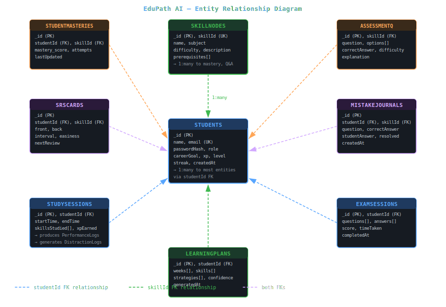

<body style="font-family:-apple-system,BlinkMacSystemFont,'Segoe UI',sans-serif;background:#0d1117;color:#c9d1d9;margin:0;padding:24px;line-height:1.7;max-width:1200px;margin:0 auto;">

<h1 style="font-size:2.4em;color:#58a6ff;border-bottom:3px solid #21262d;padding-bottom:16px;">🗂️ Entity Relationship Diagram</h1>

EduPath AI | Version 1.0 | March 2026

<h2 style="color:#79c0ff;">1. Overview</h2>

EduPath AI uses <b>MongoDB Atlas</b> as its primary database — a document-oriented NoSQL store. While MongoDB does not enforce relational constraints at the database level, the application enforces referential integrity through Mongoose schemas and application-layer validation. This document describes all 17 collections, their fields, data types, and inter-collection relationships as if they were relational entities.

<table style="border-collapse:collapse;width:100%;">
<tr style="background:#161b22;"><th style="border:1px solid #30363d;padding:10px;color:#79c0ff;">Collection</th><th style="border:1px solid #30363d;padding:10px;color:#79c0ff;">Primary Key</th><th style="border:1px solid #30363d;padding:10px;color:#79c0ff;">Description</th></tr>
<tr><td style="border:1px solid #30363d;padding:10px;">students</td><td style="border:1px solid #30363d;padding:10px;">_id (ObjectId)</td><td style="border:1px solid #30363d;padding:10px;">Core user entity — students and teachers</td></tr>
<tr><td style="border:1px solid #30363d;padding:10px;">skillnodes</td><td style="border:1px solid #30363d;padding:10px;">_id (ObjectId)</td><td style="border:1px solid #30363d;padding:10px;">Curriculum skill graph nodes</td></tr>
<tr><td style="border:1px solid #30363d;padding:10px;">studentmasteries</td><td style="border:1px solid #30363d;padding:10px;">_id (ObjectId)</td><td style="border:1px solid #30363d;padding:10px;">BKT mastery score per student per skill</td></tr>
<tr><td style="border:1px solid #30363d;padding:10px;">assessmentquestions</td><td style="border:1px solid #30363d;padding:10px;">_id (ObjectId)</td><td style="border:1px solid #30363d;padding:10px;">Quiz questions linked to skills</td></tr>
<tr><td style="border:1px solid #30363d;padding:10px;">studysessions</td><td style="border:1px solid #30363d;padding:10px;">_id (ObjectId)</td><td style="border:1px solid #30363d;padding:10px;">Timed study session records</td></tr>
<tr><td style="border:1px solid #30363d;padding:10px;">srscards</td><td style="border:1px solid #30363d;padding:10px;">_id (ObjectId)</td><td style="border:1px solid #30363d;padding:10px;">Spaced repetition flashcards</td></tr>
<tr><td style="border:1px solid #30363d;padding:10px;">mistakejournals</td><td style="border:1px solid #30363d;padding:10px;">_id (ObjectId)</td><td style="border:1px solid #30363d;padding:10px;">Logged incorrect answers for review</td></tr>
<tr><td style="border:1px solid #30363d;padding:10px;">examsessions</td><td style="border:1px solid #30363d;padding:10px;">_id (ObjectId)</td><td style="border:1px solid #30363d;padding:10px;">Timed exam attempts and results</td></tr>
<tr><td style="border:1px solid #30363d;padding:10px;">learningplans</td><td style="border:1px solid #30363d;padding:10px;">_id (ObjectId)</td><td style="border:1px solid #30363d;padding:10px;">AI-generated weekly study plans</td></tr>
<tr><td style="border:1px solid #30363d;padding:10px;">todotasks</td><td style="border:1px solid #30363d;padding:10px;">_id (ObjectId)</td><td style="border:1px solid #30363d;padding:10px;">Daily challenge tasks</td></tr>
<tr><td style="border:1px solid #30363d;padding:10px;">topicassignments</td><td style="border:1px solid #30363d;padding:10px;">_id (ObjectId)</td><td style="border:1px solid #30363d;padding:10px;">Teacher-to-student topic assignments</td></tr>
<tr><td style="border:1px solid #30363d;padding:10px;">notifications</td><td style="border:1px solid #30363d;padding:10px;">_id (ObjectId)</td><td style="border:1px solid #30363d;padding:10px;">In-app notification messages</td></tr>
<tr><td style="border:1px solid #30363d;padding:10px;">performancelogs</td><td style="border:1px solid #30363d;padding:10px;">_id (ObjectId)</td><td style="border:1px solid #30363d;padding:10px;">Per-session accuracy and response time</td></tr>
<tr><td style="border:1px solid #30363d;padding:10px;">distractionlogs</td><td style="border:1px solid #30363d;padding:10px;">_id (ObjectId)</td><td style="border:1px solid #30363d;padding:10px;">Focus anomaly detection records</td></tr>
<tr><td style="border:1px solid #30363d;padding:10px;">tutorfeedbacks</td><td style="border:1px solid #30363d;padding:10px;">_id (ObjectId)</td><td style="border:1px solid #30363d;padding:10px;">AI tutor interaction ratings</td></tr>
<tr><td style="border:1px solid #30363d;padding:10px;">learningcontents</td><td style="border:1px solid #30363d;padding:10px;">_id (ObjectId)</td><td style="border:1px solid #30363d;padding:10px;">Curated learning resources per skill</td></tr>
<tr><td style="border:1px solid #30363d;padding:10px;">userprogress</td><td style="border:1px solid #30363d;padding:10px;">_id (ObjectId)</td><td style="border:1px solid #30363d;padding:10px;">Aggregate progress tracking per user</td></tr>
</table>

<h2 style="color:#79c0ff;">2. Entity Definitions</h2>

<h3 style="color:#d2a8ff;">students</h3>
<table style="border-collapse:collapse;width:100%;">
<tr style="background:#161b22;"><th style="border:1px solid #30363d;padding:10px;color:#79c0ff;">Field</th><th style="border:1px solid #30363d;padding:10px;color:#79c0ff;">Type</th><th style="border:1px solid #30363d;padding:10px;color:#79c0ff;">Required</th><th style="border:1px solid #30363d;padding:10px;color:#79c0ff;">Description</th></tr>
<tr><td style="border:1px solid #30363d;padding:10px;">_id</td><td style="border:1px solid #30363d;padding:10px;">ObjectId</td><td style="border:1px solid #30363d;padding:10px;">✅ PK</td><td style="border:1px solid #30363d;padding:10px;">Auto-generated primary key</td></tr>
<tr><td style="border:1px solid #30363d;padding:10px;">name</td><td style="border:1px solid #30363d;padding:10px;">String</td><td style="border:1px solid #30363d;padding:10px;">✅</td><td style="border:1px solid #30363d;padding:10px;">Full display name</td></tr>
<tr><td style="border:1px solid #30363d;padding:10px;">email</td><td style="border:1px solid #30363d;padding:10px;">String</td><td style="border:1px solid #30363d;padding:10px;">✅ Unique</td><td style="border:1px solid #30363d;padding:10px;">Login email — indexed, unique</td></tr>
<tr><td style="border:1px solid #30363d;padding:10px;">passwordHash</td><td style="border:1px solid #30363d;padding:10px;">String</td><td style="border:1px solid #30363d;padding:10px;">✅</td><td style="border:1px solid #30363d;padding:10px;">bcryptjs hash, 10 salt rounds</td></tr>
<tr><td style="border:1px solid #30363d;padding:10px;">role</td><td style="border:1px solid #30363d;padding:10px;">String</td><td style="border:1px solid #30363d;padding:10px;">✅</td><td style="border:1px solid #30363d;padding:10px;">Enum: "student" | "teacher"</td></tr>
<tr><td style="border:1px solid #30363d;padding:10px;">careerGoal</td><td style="border:1px solid #30363d;padding:10px;">String</td><td style="border:1px solid #30363d;padding:10px;">❌</td><td style="border:1px solid #30363d;padding:10px;">Target career path for recommendation alignment</td></tr>
<tr><td style="border:1px solid #30363d;padding:10px;">xp</td><td style="border:1px solid #30363d;padding:10px;">Number</td><td style="border:1px solid #30363d;padding:10px;">✅ Default: 0</td><td style="border:1px solid #30363d;padding:10px;">Total experience points earned</td></tr>
<tr><td style="border:1px solid #30363d;padding:10px;">level</td><td style="border:1px solid #30363d;padding:10px;">Number</td><td style="border:1px solid #30363d;padding:10px;">✅ Default: 1</td><td style="border:1px solid #30363d;padding:10px;">Computed level from XP thresholds</td></tr>
<tr><td style="border:1px solid #30363d;padding:10px;">streak</td><td style="border:1px solid #30363d;padding:10px;">Number</td><td style="border:1px solid #30363d;padding:10px;">✅ Default: 0</td><td style="border:1px solid #30363d;padding:10px;">Consecutive daily study days</td></tr>
<tr><td style="border:1px solid #30363d;padding:10px;">createdAt</td><td style="border:1px solid #30363d;padding:10px;">Date</td><td style="border:1px solid #30363d;padding:10px;">Auto</td><td style="border:1px solid #30363d;padding:10px;">Account creation timestamp</td></tr>
</table>

<h3 style="color:#d2a8ff;">skillnodes</h3>
<table style="border-collapse:collapse;width:100%;">
<tr style="background:#161b22;"><th style="border:1px solid #30363d;padding:10px;color:#79c0ff;">Field</th><th style="border:1px solid #30363d;padding:10px;color:#79c0ff;">Type</th><th style="border:1px solid #30363d;padding:10px;color:#79c0ff;">Required</th><th style="border:1px solid #30363d;padding:10px;color:#79c0ff;">Description</th></tr>
<tr><td style="border:1px solid #30363d;padding:10px;">_id</td><td style="border:1px solid #30363d;padding:10px;">ObjectId</td><td style="border:1px solid #30363d;padding:10px;">✅ PK</td><td style="border:1px solid #30363d;padding:10px;">Auto-generated primary key</td></tr>
<tr><td style="border:1px solid #30363d;padding:10px;">skillId</td><td style="border:1px solid #30363d;padding:10px;">String</td><td style="border:1px solid #30363d;padding:10px;">✅ Unique</td><td style="border:1px solid #30363d;padding:10px;">Human-readable slug e.g. "algebra", "calculus"</td></tr>
<tr><td style="border:1px solid #30363d;padding:10px;">name</td><td style="border:1px solid #30363d;padding:10px;">String</td><td style="border:1px solid #30363d;padding:10px;">✅</td><td style="border:1px solid #30363d;padding:10px;">Display name of the skill</td></tr>
<tr><td style="border:1px solid #30363d;padding:10px;">subject</td><td style="border:1px solid #30363d;padding:10px;">String</td><td style="border:1px solid #30363d;padding:10px;">✅</td><td style="border:1px solid #30363d;padding:10px;">Subject area e.g. "Mathematics", "Computer Science"</td></tr>
<tr><td style="border:1px solid #30363d;padding:10px;">difficulty</td><td style="border:1px solid #30363d;padding:10px;">Number</td><td style="border:1px solid #30363d;padding:10px;">✅</td><td style="border:1px solid #30363d;padding:10px;">1–5 difficulty rating</td></tr>
<tr><td style="border:1px solid #30363d;padding:10px;">prerequisites</td><td style="border:1px solid #30363d;padding:10px;">String[]</td><td style="border:1px solid #30363d;padding:10px;">❌</td><td style="border:1px solid #30363d;padding:10px;">Array of skillId strings that must be mastered first</td></tr>
<tr><td style="border:1px solid #30363d;padding:10px;">description</td><td style="border:1px solid #30363d;padding:10px;">String</td><td style="border:1px solid #30363d;padding:10px;">❌</td><td style="border:1px solid #30363d;padding:10px;">Short description of what the skill covers</td></tr>
</table>

<h3 style="color:#d2a8ff;">studentmasteries</h3>
<table style="border-collapse:collapse;width:100%;">
<tr style="background:#161b22;"><th style="border:1px solid #30363d;padding:10px;color:#79c0ff;">Field</th><th style="border:1px solid #30363d;padding:10px;color:#79c0ff;">Type</th><th style="border:1px solid #30363d;padding:10px;color:#79c0ff;">Required</th><th style="border:1px solid #30363d;padding:10px;color:#79c0ff;">Description</th></tr>
<tr><td style="border:1px solid #30363d;padding:10px;">_id</td><td style="border:1px solid #30363d;padding:10px;">ObjectId</td><td style="border:1px solid #30363d;padding:10px;">✅ PK</td><td style="border:1px solid #30363d;padding:10px;">Auto-generated primary key</td></tr>
<tr><td style="border:1px solid #30363d;padding:10px;">studentId</td><td style="border:1px solid #30363d;padding:10px;">ObjectId</td><td style="border:1px solid #30363d;padding:10px;">✅ FK → students</td><td style="border:1px solid #30363d;padding:10px;">Reference to the student</td></tr>
<tr><td style="border:1px solid #30363d;padding:10px;">skillId</td><td style="border:1px solid #30363d;padding:10px;">String</td><td style="border:1px solid #30363d;padding:10px;">✅ FK → skillnodes.skillId</td><td style="border:1px solid #30363d;padding:10px;">Skill slug reference</td></tr>
<tr><td style="border:1px solid #30363d;padding:10px;">mastery_score</td><td style="border:1px solid #30363d;padding:10px;">Number</td><td style="border:1px solid #30363d;padding:10px;">✅</td><td style="border:1px solid #30363d;padding:10px;">BKT posterior probability 0.0–1.0</td></tr>
<tr><td style="border:1px solid #30363d;padding:10px;">attempts</td><td style="border:1px solid #30363d;padding:10px;">Number</td><td style="border:1px solid #30363d;padding:10px;">✅ Default: 0</td><td style="border:1px solid #30363d;padding:10px;">Total number of answer attempts</td></tr>
<tr><td style="border:1px solid #30363d;padding:10px;">lastUpdated</td><td style="border:1px solid #30363d;padding:10px;">Date</td><td style="border:1px solid #30363d;padding:10px;">Auto</td><td style="border:1px solid #30363d;padding:10px;">Timestamp of last BKT update</td></tr>
</table>

<h3 style="color:#d2a8ff;">srscards</h3>
<table style="border-collapse:collapse;width:100%;">
<tr style="background:#161b22;"><th style="border:1px solid #30363d;padding:10px;color:#79c0ff;">Field</th><th style="border:1px solid #30363d;padding:10px;color:#79c0ff;">Type</th><th style="border:1px solid #30363d;padding:10px;color:#79c0ff;">Required</th><th style="border:1px solid #30363d;padding:10px;color:#79c0ff;">Description</th></tr>
<tr><td style="border:1px solid #30363d;padding:10px;">_id</td><td style="border:1px solid #30363d;padding:10px;">ObjectId</td><td style="border:1px solid #30363d;padding:10px;">✅ PK</td><td style="border:1px solid #30363d;padding:10px;">Auto-generated primary key</td></tr>
<tr><td style="border:1px solid #30363d;padding:10px;">studentId</td><td style="border:1px solid #30363d;padding:10px;">ObjectId</td><td style="border:1px solid #30363d;padding:10px;">✅ FK → students</td><td style="border:1px solid #30363d;padding:10px;">Owner of the card</td></tr>
<tr><td style="border:1px solid #30363d;padding:10px;">skillId</td><td style="border:1px solid #30363d;padding:10px;">String</td><td style="border:1px solid #30363d;padding:10px;">✅ FK → skillnodes.skillId</td><td style="border:1px solid #30363d;padding:10px;">Skill this card belongs to</td></tr>
<tr><td style="border:1px solid #30363d;padding:10px;">front</td><td style="border:1px solid #30363d;padding:10px;">String</td><td style="border:1px solid #30363d;padding:10px;">✅</td><td style="border:1px solid #30363d;padding:10px;">Question / prompt side of the card</td></tr>
<tr><td style="border:1px solid #30363d;padding:10px;">back</td><td style="border:1px solid #30363d;padding:10px;">String</td><td style="border:1px solid #30363d;padding:10px;">✅</td><td style="border:1px solid #30363d;padding:10px;">Answer / explanation side of the card</td></tr>
<tr><td style="border:1px solid #30363d;padding:10px;">interval</td><td style="border:1px solid #30363d;padding:10px;">Number</td><td style="border:1px solid #30363d;padding:10px;">✅ Default: 1</td><td style="border:1px solid #30363d;padding:10px;">SM-2 review interval in days</td></tr>
<tr><td style="border:1px solid #30363d;padding:10px;">easiness</td><td style="border:1px solid #30363d;padding:10px;">Number</td><td style="border:1px solid #30363d;padding:10px;">✅ Default: 2.5</td><td style="border:1px solid #30363d;padding:10px;">SM-2 easiness factor</td></tr>
<tr><td style="border:1px solid #30363d;padding:10px;">repetitions</td><td style="border:1px solid #30363d;padding:10px;">Number</td><td style="border:1px solid #30363d;padding:10px;">✅ Default: 0</td><td style="border:1px solid #30363d;padding:10px;">Number of successful reviews</td></tr>
<tr><td style="border:1px solid #30363d;padding:10px;">nextReview</td><td style="border:1px solid #30363d;padding:10px;">Date</td><td style="border:1px solid #30363d;padding:10px;">✅</td><td style="border:1px solid #30363d;padding:10px;">Next scheduled review date</td></tr>
</table>

<h2 style="color:#79c0ff;">3. Relationships Summary</h2>
<table style="border-collapse:collapse;width:100%;">
<tr style="background:#161b22;"><th style="border:1px solid #30363d;padding:10px;color:#79c0ff;">From</th><th style="border:1px solid #30363d;padding:10px;color:#79c0ff;">To</th><th style="border:1px solid #30363d;padding:10px;color:#79c0ff;">Type</th><th style="border:1px solid #30363d;padding:10px;color:#79c0ff;">Via Field</th></tr>
<tr><td style="border:1px solid #30363d;padding:10px;">students</td><td style="border:1px solid #30363d;padding:10px;">studentmasteries</td><td style="border:1px solid #30363d;padding:10px;">1 → Many</td><td style="border:1px solid #30363d;padding:10px;">studentmasteries.studentId</td></tr>
<tr><td style="border:1px solid #30363d;padding:10px;">skillnodes</td><td style="border:1px solid #30363d;padding:10px;">studentmasteries</td><td style="border:1px solid #30363d;padding:10px;">1 → Many</td><td style="border:1px solid #30363d;padding:10px;">studentmasteries.skillId</td></tr>
<tr><td style="border:1px solid #30363d;padding:10px;">students</td><td style="border:1px solid #30363d;padding:10px;">srscards</td><td style="border:1px solid #30363d;padding:10px;">1 → Many</td><td style="border:1px solid #30363d;padding:10px;">srscards.studentId</td></tr>
<tr><td style="border:1px solid #30363d;padding:10px;">students</td><td style="border:1px solid #30363d;padding:10px;">studysessions</td><td style="border:1px solid #30363d;padding:10px;">1 → Many</td><td style="border:1px solid #30363d;padding:10px;">studysessions.studentId</td></tr>
<tr><td style="border:1px solid #30363d;padding:10px;">students</td><td style="border:1px solid #30363d;padding:10px;">mistakejournals</td><td style="border:1px solid #30363d;padding:10px;">1 → Many</td><td style="border:1px solid #30363d;padding:10px;">mistakejournals.studentId</td></tr>
<tr><td style="border:1px solid #30363d;padding:10px;">students</td><td style="border:1px solid #30363d;padding:10px;">examsessions</td><td style="border:1px solid #30363d;padding:10px;">1 → Many</td><td style="border:1px solid #30363d;padding:10px;">examsessions.studentId</td></tr>
<tr><td style="border:1px solid #30363d;padding:10px;">students</td><td style="border:1px solid #30363d;padding:10px;">learningplans</td><td style="border:1px solid #30363d;padding:10px;">1 → 1</td><td style="border:1px solid #30363d;padding:10px;">learningplans.studentId</td></tr>
<tr><td style="border:1px solid #30363d;padding:10px;">students</td><td style="border:1px solid #30363d;padding:10px;">todotasks</td><td style="border:1px solid #30363d;padding:10px;">1 → Many</td><td style="border:1px solid #30363d;padding:10px;">todotasks.studentId</td></tr>
<tr><td style="border:1px solid #30363d;padding:10px;">students (teacher)</td><td style="border:1px solid #30363d;padding:10px;">topicassignments</td><td style="border:1px solid #30363d;padding:10px;">1 → Many</td><td style="border:1px solid #30363d;padding:10px;">topicassignments.teacherId</td></tr>
<tr><td style="border:1px solid #30363d;padding:10px;">students</td><td style="border:1px solid #30363d;padding:10px;">notifications</td><td style="border:1px solid #30363d;padding:10px;">1 → Many</td><td style="border:1px solid #30363d;padding:10px;">notifications.userId</td></tr>
<tr><td style="border:1px solid #30363d;padding:10px;">studysessions</td><td style="border:1px solid #30363d;padding:10px;">performancelogs</td><td style="border:1px solid #30363d;padding:10px;">1 → Many</td><td style="border:1px solid #30363d;padding:10px;">performancelogs.sessionId</td></tr>
<tr><td style="border:1px solid #30363d;padding:10px;">studysessions</td><td style="border:1px solid #30363d;padding:10px;">distractionlogs</td><td style="border:1px solid #30363d;padding:10px;">1 → Many</td><td style="border:1px solid #30363d;padding:10px;">distractionlogs.sessionId</td></tr>
<tr><td style="border:1px solid #30363d;padding:10px;">skillnodes</td><td style="border:1px solid #30363d;padding:10px;">skillnodes</td><td style="border:1px solid #30363d;padding:10px;">Many → Many (self)</td><td style="border:1px solid #30363d;padding:10px;">skillnodes.prerequisites[]</td></tr>
<tr><td style="border:1px solid #30363d;padding:10px;">skillnodes</td><td style="border:1px solid #30363d;padding:10px;">assessmentquestions</td><td style="border:1px solid #30363d;padding:10px;">1 → Many</td><td style="border:1px solid #30363d;padding:10px;">assessmentquestions.skillId</td></tr>
<tr><td style="border:1px solid #30363d;padding:10px;">skillnodes</td><td style="border:1px solid #30363d;padding:10px;">learningcontents</td><td style="border:1px solid #30363d;padding:10px;">1 → Many</td><td style="border:1px solid #30363d;padding:10px;">learningcontents.skillId</td></tr>
</table>

<h2 style="color:#79c0ff;">4. ER Diagram</h2>

</body>
