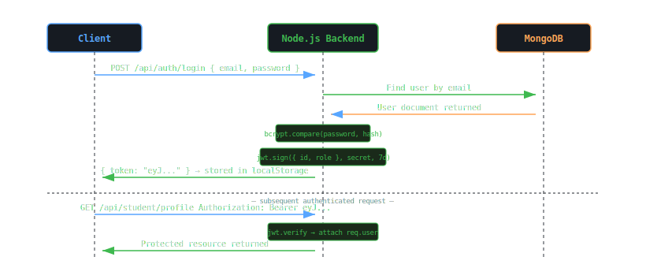

<body style="font-family:-apple-system,BlinkMacSystemFont,'Segoe UI',sans-serif;background:#0d1117;color:#c9d1d9;margin:0;padding:24px;line-height:1.7;max-width:1200px;margin:0 auto;">

<h1 style="font-size:2.4em;color:#58a6ff;border-bottom:3px solid #21262d;padding-bottom:16px;">🔒 Security Model</h1>

EduPath AI | Version 1.0 | March 2026

<h2 style="color:#79c0ff;">1. Authentication System</h2>

EduPath AI uses <b>stateless JWT authentication</b>. No sessions are stored server-side. Every request carries a self-contained signed token.

<h3 style="color:#d2a8ff;">JWT Token Flow</h3>

<table style="border-collapse:collapse;width:100%;">
<tr style="background:#161b22;"><th style="border:1px solid #30363d;padding:10px;color:#79c0ff;">Property</th><th style="border:1px solid #30363d;padding:10px;color:#79c0ff;">Value</th><th style="border:1px solid #30363d;padding:10px;color:#79c0ff;">Rationale</th></tr>
<tr><td style="border:1px solid #30363d;padding:10px;">Algorithm</td><td style="border:1px solid #30363d;padding:10px;">HS256 (HMAC-SHA256)</td><td style="border:1px solid #30363d;padding:10px;">Symmetric — fast, sufficient for single-service auth</td></tr>
<tr><td style="border:1px solid #30363d;padding:10px;">Expiry</td><td style="border:1px solid #30363d;padding:10px;">7 days</td><td style="border:1px solid #30363d;padding:10px;">Balance between UX (no frequent re-login) and security</td></tr>
<tr><td style="border:1px solid #30363d;padding:10px;">Payload</td><td style="border:1px solid #30363d;padding:10px;">{ id, role }</td><td style="border:1px solid #30363d;padding:10px;">Minimal — no PII in token payload</td></tr>
<tr><td style="border:1px solid #30363d;padding:10px;">Storage</td><td style="border:1px solid #30363d;padding:10px;">localStorage</td><td style="border:1px solid #30363d;padding:10px;">Accessible to JS — XSS risk mitigated by CSP headers</td></tr>
<tr><td style="border:1px solid #30363d;padding:10px;">Revocation</td><td style="border:1px solid #30363d;padding:10px;">Not implemented (stateless)</td><td style="border:1px solid #30363d;padding:10px;">Acceptable at MVP scale; token blacklist can be added</td></tr>
</table>

<h2 style="color:#79c0ff;">2. Authorization Model (RBAC)</h2>

EduPath AI implements a simple two-role <b>Role-Based Access Control</b> system enforced by <code style="background:#161b22;border:1px solid #30363d;border-radius:4px;padding:2px 6px;color:#f0883e;">roleMiddleware.js</code>.

<table style="border-collapse:collapse;width:100%;">
<tr style="background:#161b22;"><th style="border:1px solid #30363d;padding:10px;color:#79c0ff;">Role</th><th style="border:1px solid #30363d;padding:10px;color:#79c0ff;">Permissions</th><th style="border:1px solid #30363d;padding:10px;color:#79c0ff;">Restricted From</th></tr>
<tr><td style="border:1px solid #30363d;padding:10px;">student</td><td style="border:1px solid #30363d;padding:10px;">Own profile, own mastery, assessments, SRS, XP, tutor, plan, todo, notifications, leaderboard, study sessions, mistakes, exams</td><td style="border:1px solid #30363d;padding:10px;">GET /api/student/all, POST /api/assignments</td></tr>
<tr><td style="border:1px solid #30363d;padding:10px;">teacher</td><td style="border:1px solid #30363d;padding:10px;">All student permissions + GET /api/student/all, POST /api/assignments, view all student analytics</td><td style="border:1px solid #30363d;padding:10px;">Nothing additional restricted</td></tr>
<tr><td style="border:1px solid #30363d;padding:10px;">public</td><td style="border:1px solid #30363d;padding:10px;">POST /api/auth/register, POST /api/auth/login, GET /health</td><td style="border:1px solid #30363d;padding:10px;">All other endpoints</td></tr>
</table>

<b>Data isolation:</b> All student-scoped queries use <code style="background:#161b22;border:1px solid #30363d;border-radius:4px;padding:2px 6px;color:#f0883e;">req.user.id</code> from the verified JWT as the filter. Students cannot access other students' data even if they guess an ObjectId.

<h2 style="color:#79c0ff;">3. Password Security</h2>
<table style="border-collapse:collapse;width:100%;">
<tr style="background:#161b22;"><th style="border:1px solid #30363d;padding:10px;color:#79c0ff;">Control</th><th style="border:1px solid #30363d;padding:10px;color:#79c0ff;">Implementation</th></tr>
<tr><td style="border:1px solid #30363d;padding:10px;">Hashing algorithm</td><td style="border:1px solid #30363d;padding:10px;">bcryptjs with 10 salt rounds (~100ms per hash)</td></tr>
<tr><td style="border:1px solid #30363d;padding:10px;">Plain text storage</td><td style="border:1px solid #30363d;padding:10px;">Never — only passwordHash stored in DB</td></tr>
<tr><td style="border:1px solid #30363d;padding:10px;">Password in API response</td><td style="border:1px solid #30363d;padding:10px;">Never — passwordHash excluded from all responses via Mongoose select: false</td></tr>
<tr><td style="border:1px solid #30363d;padding:10px;">Minimum length</td><td style="border:1px solid #30363d;padding:10px;">8 characters enforced at schema level</td></tr>
<tr><td style="border:1px solid #30363d;padding:10px;">Brute force protection</td><td style="border:1px solid #30363d;padding:10px;">bcrypt cost factor makes brute force computationally expensive</td></tr>
</table>

<h2 style="color:#79c0ff;">4. Secrets Management</h2>
<table style="border-collapse:collapse;width:100%;">
<tr style="background:#161b22;"><th style="border:1px solid #30363d;padding:10px;color:#79c0ff;">Secret</th><th style="border:1px solid #30363d;padding:10px;color:#79c0ff;">Storage</th><th style="border:1px solid #30363d;padding:10px;color:#79c0ff;">Access Pattern</th></tr>
<tr><td style="border:1px solid #30363d;padding:10px;">JWT_SECRET</td><td style="border:1px solid #30363d;padding:10px;">Environment variable (Render.com secret)</td><td style="border:1px solid #30363d;padding:10px;">process.env.JWT_SECRET — never logged</td></tr>
<tr><td style="border:1px solid #30363d;padding:10px;">MONGODB_URI</td><td style="border:1px solid #30363d;padding:10px;">Environment variable</td><td style="border:1px solid #30363d;padding:10px;">Connection string with credentials — never in code</td></tr>
<tr><td style="border:1px solid #30363d;padding:10px;">GEMINI_API_KEY</td><td style="border:1px solid #30363d;padding:10px;">Environment variable (Python service)</td><td style="border:1px solid #30363d;padding:10px;">Only accessed by AI service — not exposed to frontend</td></tr>
<tr><td style="border:1px solid #30363d;padding:10px;">EMAIL_PASS</td><td style="border:1px solid #30363d;padding:10px;">Environment variable</td><td style="border:1px solid #30363d;padding:10px;">Gmail App Password — not the account password</td></tr>
<tr><td style="border:1px solid #30363d;padding:10px;">.env files</td><td style="border:1px solid #30363d;padding:10px;">Listed in .gitignore</td><td style="border:1px solid #30363d;padding:10px;">Never committed to version control</td></tr>
</table>

<h2 style="color:#79c0ff;">5. API Security</h2>
<table style="border-collapse:collapse;width:100%;">
<tr style="background:#161b22;"><th style="border:1px solid #30363d;padding:10px;color:#79c0ff;">Control</th><th style="border:1px solid #30363d;padding:10px;color:#79c0ff;">Implementation</th><th style="border:1px solid #30363d;padding:10px;color:#79c0ff;">Protection Against</th></tr>
<tr><td style="border:1px solid #30363d;padding:10px;">CORS</td><td style="border:1px solid #30363d;padding:10px;">Whitelist FRONTEND_URL only via cors() middleware</td><td style="border:1px solid #30363d;padding:10px;">Cross-origin requests from unauthorized domains</td></tr>
<tr><td style="border:1px solid #30363d;padding:10px;">HTTPS</td><td style="border:1px solid #30363d;padding:10px;">Enforced by Render.com and Vercel/Netlify on all production URLs</td><td style="border:1px solid #30363d;padding:10px;">Man-in-the-middle, token interception</td></tr>
<tr><td style="border:1px solid #30363d;padding:10px;">Input validation</td><td style="border:1px solid #30363d;padding:10px;">Mongoose schema validation + Pydantic (Python)</td><td style="border:1px solid #30363d;padding:10px;">Malformed data, type injection</td></tr>
<tr><td style="border:1px solid #30363d;padding:10px;">NoSQL injection</td><td style="border:1px solid #30363d;padding:10px;">Mongoose ODM sanitizes queries; no raw MongoDB operators from user input</td><td style="border:1px solid #30363d;padding:10px;">MongoDB operator injection ($where, $gt)</td></tr>
<tr><td style="border:1px solid #30363d;padding:10px;">Rate limiting</td><td style="border:1px solid #30363d;padding:10px;">Recommended: express-rate-limit on /api/auth routes</td><td style="border:1px solid #30363d;padding:10px;">Brute force login attacks</td></tr>
<tr><td style="border:1px solid #30363d;padding:10px;">Helmet.js</td><td style="border:1px solid #30363d;padding:10px;">Recommended: sets security HTTP headers</td><td style="border:1px solid #30363d;padding:10px;">XSS, clickjacking, MIME sniffing</td></tr>
<tr><td style="border:1px solid #30363d;padding:10px;">AI service isolation</td><td style="border:1px solid #30363d;padding:10px;">Python service not exposed to public internet — only called by Node.js backend</td><td style="border:1px solid #30363d;padding:10px;">Direct AI service abuse</td></tr>
</table>

<h2 style="color:#79c0ff;">6. Data Protection</h2>
<table style="border-collapse:collapse;width:100%;">
<tr style="background:#161b22;"><th style="border:1px solid #30363d;padding:10px;color:#79c0ff;">Data Type</th><th style="border:1px solid #30363d;padding:10px;color:#79c0ff;">Protection Measure</th></tr>
<tr><td style="border:1px solid #30363d;padding:10px;">Passwords</td><td style="border:1px solid #30363d;padding:10px;">bcrypt hashed — irreversible</td></tr>
<tr><td style="border:1px solid #30363d;padding:10px;">Student mastery data</td><td style="border:1px solid #30363d;padding:10px;">Scoped to studentId — no cross-student access</td></tr>
<tr><td style="border:1px solid #30363d;padding:10px;">MongoDB Atlas data</td><td style="border:1px solid #30363d;padding:10px;">Encrypted at rest (AES-256) by Atlas, TLS in transit</td></tr>
<tr><td style="border:1px solid #30363d;padding:10px;">API keys (Gemini)</td><td style="border:1px solid #30363d;padding:10px;">Server-side only — never sent to frontend</td></tr>
<tr><td style="border:1px solid #30363d;padding:10px;">Email addresses</td><td style="border:1px solid #30363d;padding:10px;">Stored lowercase, not exposed in leaderboard or public endpoints</td></tr>
</table>

<h2 style="color:#79c0ff;">7. Threat Mitigation Matrix</h2>
<table style="border-collapse:collapse;width:100%;">
<tr style="background:#161b22;"><th style="border:1px solid #30363d;padding:10px;color:#79c0ff;">Threat</th><th style="border:1px solid #30363d;padding:10px;color:#79c0ff;">Risk Level</th><th style="border:1px solid #30363d;padding:10px;color:#79c0ff;">Mitigation</th><th style="border:1px solid #30363d;padding:10px;color:#79c0ff;">Status</th></tr>
<tr><td style="border:1px solid #30363d;padding:10px;">JWT token theft</td><td style="border:1px solid #30363d;padding:10px;">Medium</td><td style="border:1px solid #30363d;padding:10px;">Short expiry (7d), HTTPS only, no sensitive data in payload</td><td style="border:1px solid #30363d;padding:10px;">✅ Mitigated</td></tr>
<tr><td style="border:1px solid #30363d;padding:10px;">Brute force login</td><td style="border:1px solid #30363d;padding:10px;">Medium</td><td style="border:1px solid #30363d;padding:10px;">bcrypt cost factor + recommended rate limiting</td><td style="border:1px solid #30363d;padding:10px;">⚠️ Partial</td></tr>
<tr><td style="border:1px solid #30363d;padding:10px;">NoSQL injection</td><td style="border:1px solid #30363d;padding:10px;">Low</td><td style="border:1px solid #30363d;padding:10px;">Mongoose ODM sanitizes all queries</td><td style="border:1px solid #30363d;padding:10px;">✅ Mitigated</td></tr>
<tr><td style="border:1px solid #30363d;padding:10px;">XSS</td><td style="border:1px solid #30363d;padding:10px;">Medium</td><td style="border:1px solid #30363d;padding:10px;">React escapes output by default; Helmet.js recommended</td><td style="border:1px solid #30363d;padding:10px;">⚠️ Partial</td></tr>
<tr><td style="border:1px solid #30363d;padding:10px;">CSRF</td><td style="border:1px solid #30363d;padding:10px;">Low</td><td style="border:1px solid #30363d;padding:10px;">JWT in Authorization header (not cookies) — immune to CSRF</td><td style="border:1px solid #30363d;padding:10px;">✅ Mitigated</td></tr>
<tr><td style="border:1px solid #30363d;padding:10px;">Unauthorized data access</td><td style="border:1px solid #30363d;padding:10px;">Low</td><td style="border:1px solid #30363d;padding:10px;">All queries scoped to req.user.id from verified JWT</td><td style="border:1px solid #30363d;padding:10px;">✅ Mitigated</td></tr>
<tr><td style="border:1px solid #30363d;padding:10px;">Secret exposure</td><td style="border:1px solid #30363d;padding:10px;">High</td><td style="border:1px solid #30363d;padding:10px;">All secrets in env vars, .env in .gitignore</td><td style="border:1px solid #30363d;padding:10px;">✅ Mitigated</td></tr>
<tr><td style="border:1px solid #30363d;padding:10px;">DDoS</td><td style="border:1px solid #30363d;padding:10px;">Medium</td><td style="border:1px solid #30363d;padding:10px;">Render.com infrastructure + recommended rate limiting</td><td style="border:1px solid #30363d;padding:10px;">⚠️ Partial</td></tr>
<tr><td style="border:1px solid #30363d;padding:10px;">Gemini API abuse</td><td style="border:1px solid #30363d;padding:10px;">Medium</td><td style="border:1px solid #30363d;padding:10px;">Key server-side only; auth required before tutor calls</td><td style="border:1px solid #30363d;padding:10px;">✅ Mitigated</td></tr>
</table>

</body>
