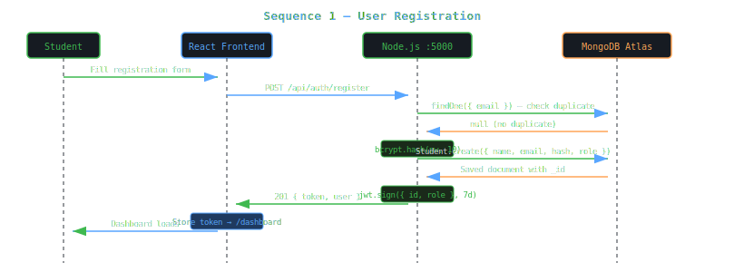
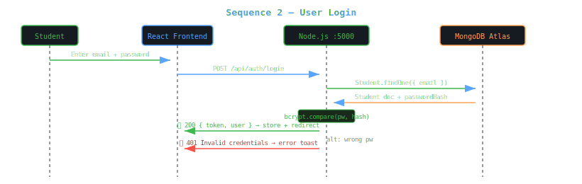
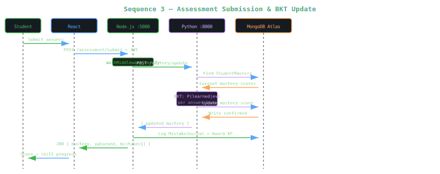
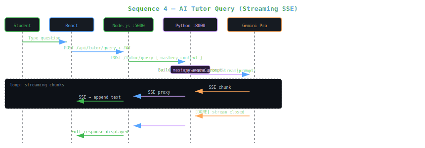
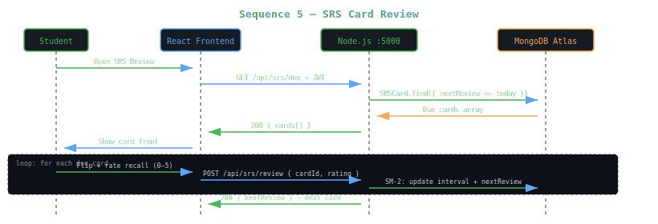
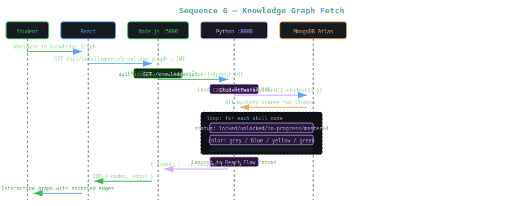
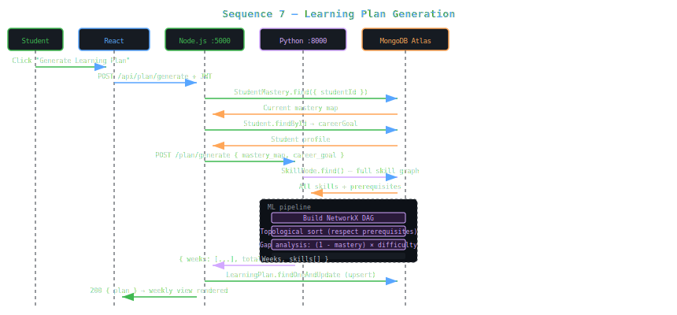

<body style="font-family:-apple-system,BlinkMacSystemFont,'Segoe UI',sans-serif;background:#0d1117;color:#c9d1d9;margin:0;padding:24px;line-height:1.7;max-width:1200px;margin:0 auto;">

<h1 style="font-size:2.4em;color:#58a6ff;border-bottom:3px solid #21262d;padding-bottom:16px;">📊 Sequence Diagrams</h1>

EduPath AI | Version 1.0 | March 2026

<h2 style="color:#79c0ff;">1. User Registration</h2>

Complete sequence from form submission through account creation, JWT issuance, and initial data seeding.

<h2 style="color:#79c0ff;">2. User Login</h2>

<h2 style="color:#79c0ff;">3. Assessment Submission & BKT Update</h2>

The most complex flow — from quiz answer submission through BKT computation to mastery update and mistake logging.

<h2 style="color:#79c0ff;">4. AI Tutor Query (Streaming)</h2>

The streaming SSE flow from student question through Gemini Pro to real-time text rendering.

<h2 style="color:#79c0ff;">5. SRS Card Review</h2>

<h2 style="color:#79c0ff;">6. Knowledge Graph Fetch</h2>

How the interactive skill graph is built — from JWT auth through NetworkX DAG traversal to React Flow rendering.

<h2 style="color:#79c0ff;">7. Learning Plan Generation</h2>

The full ML pipeline — from mastery fetch through topological sort, gap analysis, and weekly scheduling to plan persistence.

</body>
