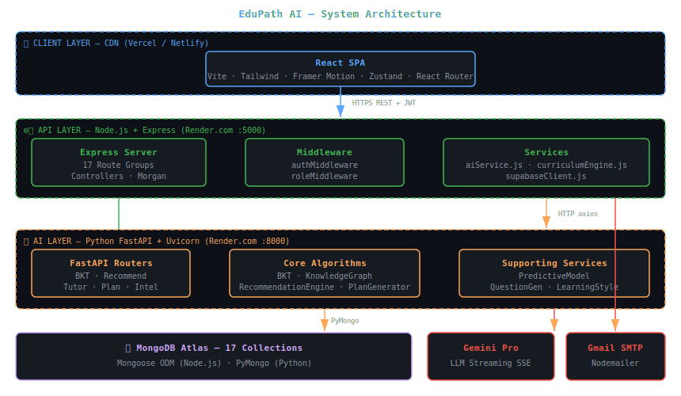

<body style="font-family:-apple-system,BlinkMacSystemFont,'Segoe UI',sans-serif;background:#0d1117;color:#c9d1d9;margin:0;padding:24px;line-height:1.7;max-width:1200px;margin:0 auto;">

<h1 style="font-size:2.4em;color:#58a6ff;border-bottom:3px solid #21262d;padding-bottom:16px;">🏛️ System Architecture Document</h1>

EduPath AI | Version 1.0 | March 2026

<h2 style="color:#79c0ff;">1. Architecture Style</h2>

EduPath AI uses a <b>Microservices-Lite architecture</b> — a pragmatic hybrid between a monolith and full microservices. The system has two independently deployable backend services (Node.js + Python) that share a single database, rather than a full microservices mesh with per-service databases.

<h3 style="color:#d2a8ff;">Architecture Decision: Why Not Full Microservices?</h3>
<table style="border-collapse:collapse;width:100%;">
<tr style="background:#161b22;"><th style="border:1px solid #30363d;padding:10px;color:#79c0ff;">Consideration</th><th style="border:1px solid #30363d;padding:10px;color:#79c0ff;">Decision</th><th style="border:1px solid #30363d;padding:10px;color:#79c0ff;">Rationale</th></tr>
<tr><td style="border:1px solid #30363d;padding:10px;">Service separation</td><td style="border:1px solid #30363d;padding:10px;">2 services (Node + Python)</td><td style="border:1px solid #30363d;padding:10px;">Language boundary — JS for CRUD, Python for ML</td></tr>
<tr><td style="border:1px solid #30363d;padding:10px;">Database</td><td style="border:1px solid #30363d;padding:10px;">Shared MongoDB Atlas</td><td style="border:1px solid #30363d;padding:10px;">Avoids data sync complexity at current scale</td></tr>
<tr><td style="border:1px solid #30363d;padding:10px;">Service mesh</td><td style="border:1px solid #30363d;padding:10px;">Direct HTTP calls</td><td style="border:1px solid #30363d;padding:10px;">No Kubernetes overhead needed at MVP scale</td></tr>
<tr><td style="border:1px solid #30363d;padding:10px;">API Gateway</td><td style="border:1px solid #30363d;padding:10px;">Node.js acts as gateway</td><td style="border:1px solid #30363d;padding:10px;">Frontend only talks to one backend URL</td></tr>
</table>

<h2 style="color:#79c0ff;">2. Architecture Layers</h2>

<h3 style="color:#d2a8ff;">Layer 1 — Presentation (Frontend)</h3>
<ul>
<li><b>Technology:</b> React 18 + Vite + Tailwind CSS + Framer Motion</li>
<li><b>Deployment:</b> Static SPA on Vercel/Netlify CDN</li>
<li><b>Responsibilities:</b> UI rendering, client-side routing, state management, API calls</li>
<li><b>State:</b> Zustand for global state, React useState for local UI state</li>
<li><b>Auth:</b> JWT stored in localStorage, attached to every API request via axios interceptor</li>
</ul>

<h3 style="color:#d2a8ff;">Layer 2 — API Gateway (Node.js Backend)</h3>
<ul>
<li><b>Technology:</b> Node.js 18 + Express 4 + Mongoose</li>
<li><b>Deployment:</b> Render.com Web Service</li>
<li><b>Responsibilities:</b> JWT verification, CORS, request routing, business logic, MongoDB CRUD, AI service proxy</li>
<li><b>Pattern:</b> MVC — Routes → Controllers → Models</li>
<li><b>Error handling:</b> express-async-errors + global error middleware</li>
</ul>

<h3 style="color:#d2a8ff;">Layer 3 — AI Service (Python FastAPI)</h3>
<ul>
<li><b>Technology:</b> Python 3.10 + FastAPI + Uvicorn</li>
<li><b>Deployment:</b> Render.com Web Service (separate instance)</li>
<li><b>Responsibilities:</b> BKT computation, skill recommendations, knowledge graph, learning plan, AI tutor, intelligence widgets</li>
<li><b>Pattern:</b> Router → Core Algorithm → MongoDB (PyMongo)</li>
<li><b>Startup:</b> Pre-builds NetworkX knowledge graph on service start</li>
</ul>

<h3 style="color:#d2a8ff;">Layer 4 — Data (MongoDB Atlas)</h3>
<ul>
<li><b>Technology:</b> MongoDB Atlas (M0 free tier → M10 production)</li>
<li><b>Collections:</b> 17 collections across all features</li>
<li><b>Access:</b> Node.js via Mongoose ODM, Python via PyMongo/motor</li>
<li><b>Indexes:</b> studentId on mastery, SRS, mistakes, sessions for fast lookups</li>
</ul>

<h3 style="color:#d2a8ff;">Layer 5 — External Services</h3>
<ul>
<li><b>Google Gemini Pro:</b> LLM API for AI Tutor streaming responses</li>
<li><b>Gmail SMTP:</b> Email notifications via Nodemailer</li>
</ul>

<h2 style="color:#79c0ff;">3. Architecture Diagram</h2>

<h2 style="color:#79c0ff;">4. Security Layer</h2>
<table style="border-collapse:collapse;width:100%;">
<tr style="background:#161b22;"><th style="border:1px solid #30363d;padding:10px;color:#79c0ff;">Security Control</th><th style="border:1px solid #30363d;padding:10px;color:#79c0ff;">Implementation</th><th style="border:1px solid #30363d;padding:10px;color:#79c0ff;">Layer</th></tr>
<tr><td style="border:1px solid #30363d;padding:10px;">Authentication</td><td style="border:1px solid #30363d;padding:10px;">JWT HS256, 7-day expiry</td><td style="border:1px solid #30363d;padding:10px;">Backend middleware</td></tr>
<tr><td style="border:1px solid #30363d;padding:10px;">Password Security</td><td style="border:1px solid #30363d;padding:10px;">bcryptjs, 10 salt rounds</td><td style="border:1px solid #30363d;padding:10px;">Auth controller</td></tr>
<tr><td style="border:1px solid #30363d;padding:10px;">CORS</td><td style="border:1px solid #30363d;padding:10px;">Whitelist FRONTEND_URL only</td><td style="border:1px solid #30363d;padding:10px;">Express middleware</td></tr>
<tr><td style="border:1px solid #30363d;padding:10px;">Role-Based Access</td><td style="border:1px solid #30363d;padding:10px;">roleMiddleware.js checks req.user.role</td><td style="border:1px solid #30363d;padding:10px;">Route middleware</td></tr>
<tr><td style="border:1px solid #30363d;padding:10px;">Secrets Management</td><td style="border:1px solid #30363d;padding:10px;">Environment variables, never in code</td><td style="border:1px solid #30363d;padding:10px;">All layers</td></tr>
<tr><td style="border:1px solid #30363d;padding:10px;">Transport Security</td><td style="border:1px solid #30363d;padding:10px;">HTTPS enforced on all production URLs</td><td style="border:1px solid #30363d;padding:10px;">Infrastructure</td></tr>
</table>
</body>
