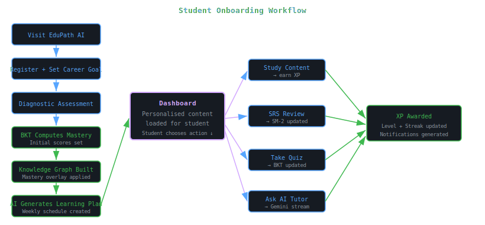
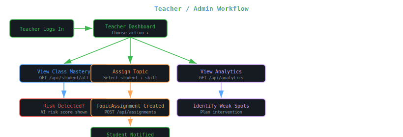
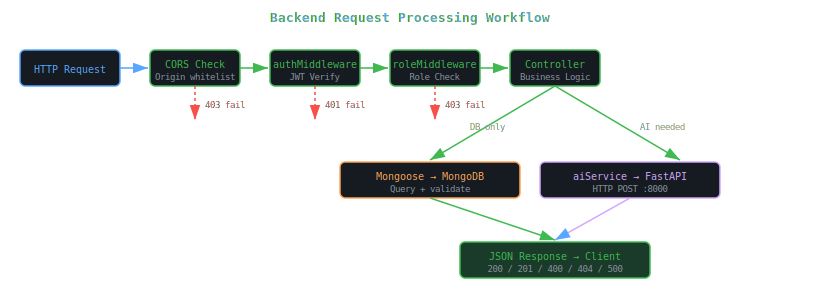
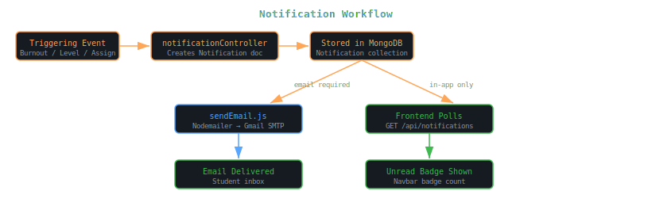
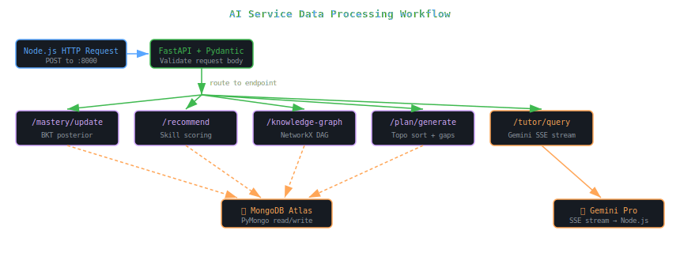
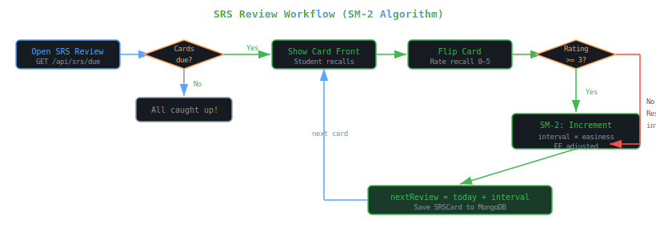

<body style="font-family:-apple-system,BlinkMacSystemFont,'Segoe UI',sans-serif;background:#0d1117;color:#c9d1d9;margin:0;padding:24px;line-height:1.7;max-width:1200px;margin:0 auto;">

<h1 style="font-size:2.4em;color:#58a6ff;border-bottom:3px solid #21262d;padding-bottom:16px;">🔀 Workflow Diagrams</h1>

EduPath AI | Version 1.0 | March 2026

<h2 style="color:#79c0ff;">1. Student Onboarding Workflow</h2>

The complete journey from first visit through registration, initial assessment, and first personalized learning plan generation.

<h2 style="color:#79c0ff;">2. Teacher / Admin Workflow</h2>

How a teacher monitors their class, assigns topics, and responds to AI-generated risk alerts.

<h2 style="color:#79c0ff;">2. Teacher / Admin Workflow</h2>

How a teacher monitors their class, assigns topics, and responds to AI-generated risk alerts.

<h2 style="color:#79c0ff;">3. Backend Request Processing Workflow</h2>

Internal workflow of the Node.js backend for every incoming API request.

<h2 style="color:#79c0ff;">4. Notification Workflow</h2>

How notifications are generated, stored, delivered in-app, and optionally sent via email.

<h2 style="color:#79c0ff;">5. AI Data Processing Workflow</h2>

The complete data processing pipeline within the Python AI microservice from request receipt to result delivery.

<h2 style="color:#79c0ff;">6. SRS Review Workflow</h2>

The Spaced Repetition System card review cycle using the SM-2 algorithm.

</body>
